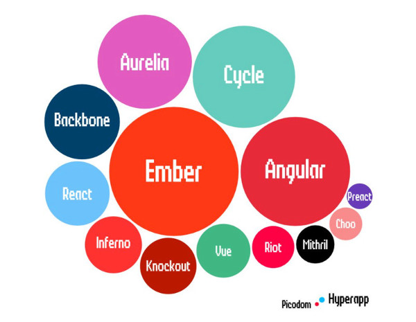
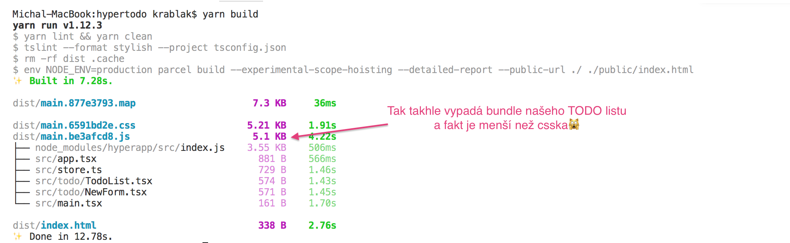
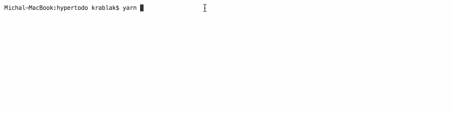

# Hyperapp TODO List

[Hyperapp](https://github.com/jorgebucaran/hyperapp) je 1kB JavaScript micro-framework, který není ani tak skvělý tím, jak je
minimalistický, ale spíš tím jak skvělou architekturu v tom maličkém balení nabízí.

Vývojář dostane přesně ty skvělé principy, které se mu tak líbí na Reactu, jen tak nějak bez všeho toho matoucího a složitého. V Hyperapp je view
vlastně jen funkce, která sestavuje DOM a dostává k tomu state(data) a actions (cestu jak data změnit). Uživatel nebo server vyvolá akci. Akce změní state, a to vyvolá překreslení view. A tak pořád dokola. Jasné, srozumitelné, a to vše v 1kB.

Ale k čemu nám to je? Máme pentia a gigabitové linky, tak proč by nás měla zajímat velikost frameworku? A odpovědí pro mě jsou mobilní zařízení a
to, že to je přesně to místo, kde svoji konkurenci můžete lehce natrhnout triko. Mrkněte třeba na [tento článek](https://medium.com/@addyosmani/the-cost-of-javascript-in-2018-7d8950fbb5d4), který vysvětluje jak se i z posledního iPhone může stát pomalé zařízení. Stačí, aby váš typický uživatel zkusil jít na váš web z hospody, obchoďáku nebo koncertu, kde je přetížená infrastruktura. A je tak nějak lepší být v povědomí uživatelů jako ta rychlá appka než jako ta hrůza co má [FCP](https://developers.google.com/web/tools/lighthouse/audits/first-contentful-paint) a [TTI](https://developers.google.com/web/tools/lighthouse/audits/time-to-interactive) asi 30 vteřin (asi 30, protože vešina lidí to ve dvacátépáté vteřině vzdá).

"No, tak použiju vanilla JS [jako netflix](https://medium.com/dev-channel/a-netflix-web-performance-case-study-c0bcde26a9d9) ne?" Řeknete si. No jasně, jen ten tolik neškáluje a brzo stejně začnete tvořit vlastní micro-framework, protože [znovupoužitelnost](https://en.wikipedia.org/wiki/Don%27t_repeat_yourself). A tady přichází [Hyperapp](https://github.com/jorgebucaran/hyperapp) jako zajímavá alternativa.

My jsme na [Hyperapp](https://github.com/jorgebucaran/hyperapp) narazili ze [slidů Gleba Bamutova](https://slides.com/bahmutov/hyperapp#/), který ho ukazuje v super kombinaci s [Parcel](https://parceljs.org/packagers.html) a naším milovaným TypeScriptem. Takže jsme ho hned vzali a vystřelili s ním klasický TODO List app a porovnali [s tím, který máme jako onboarding projekt napsaný v Reactu s MobX](https://gitlab.com/holly-prototypes/feonboard). Zpětně vidíme řešení s Reactem spíš na intranetové appky, kde na nějakém tom KB nezáleží a je třeba střílet implementaci ve kadencí rotačního kulometu. Hyperapp pak na místa, kde potřebujeme rychlost a uživatelskou interaktivitu, na kterou server side rendering už nestačí.

Co je super:

- velikost výsledného js bundlu TODO app:
  - Hyperapp **5.1 KB**,
  - React, MobX **72.13 KB**,
- psaní view je s trochou zkušeností s JSX velice jednoduché,
- Hyperapp používá přímo DOM události, takže se nás ušetří jedné úrovně abstrakce,
- komplexita state managementu je oproti Reduxu nebo MobX řádově menší.

Co už není úplně super:

- není to takovej pop jako React, takže kupu věcí je třeba si vymyslet sám,
- není k dispozici snad ani jeden set komponent (něco [ve stylu Material-UI](https://material-ui.com/)).
- S Reactem a MobX dokážeme překreslovat je konkrétní části UI, pro která se změnila data, a to jsem s Hyperapp nezkoušel. Jde to? Mohlo by.
- Parcel se párkát *zasekl* na kompilaci Typescriptu. Hyperapp za to nemůže, ale pokazí to uživatelskou/vývojářskou zkušenost.

A velice blízko je vydání [Hyperapp verze 2](https://github.com/jorgebucaran/hyperapp/pull/726) a už teď se těšíme.

## Jak to rozběhnout

1. Naistalovat zavislosti:

        yarn install

2. Vybuildit:

        yarn build

3. Nebo spustit:

        yarn start

## Co je kde:

- *src/main.tsx* vstupní bod aplikace
- *public/index.html* HTML, ze kterého je odkázán *src/main.tsx* a Parcel ho použije ke spuštění aplikace
- *src/app.tsx* tady najdeme hlavní view a jeho spojení se state a actions
- *src/store.ts* obsahuje data(state) a busines logiku(actions)
- *src/todo/TodoList.tsx* komponenta pro zobrazeni položek TODO listu
- *src/todo/NewForm.tsx* 'formulář' pro přidání položky
